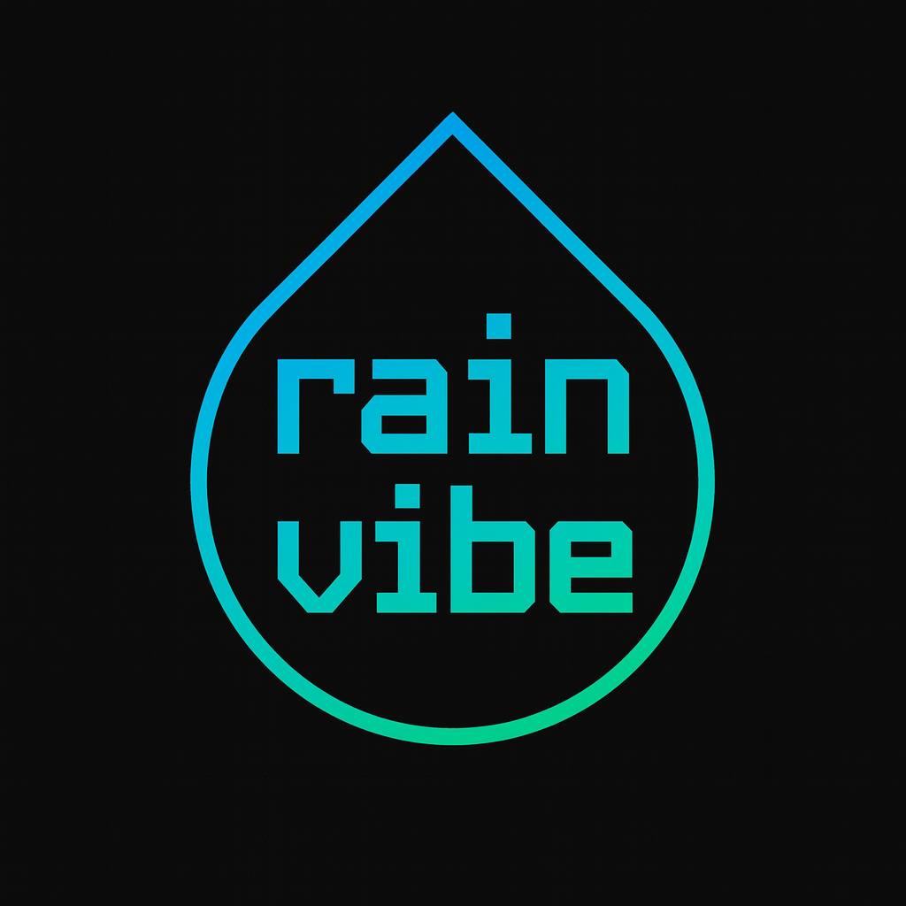

<div align="center">
  
</div>

---

## In a nutshell 

RainVibe is a Monaco-based IDE powered by ChatGPT, with modes tuned to real workflows: Coach for onboarding and upskilling, Bug Fixer for root-cause fixes, Policy-Safe for enforced guardrails, Compliance/Audit for traceable changes, and Basic for fast codegen build tasks.

---

## Why RainVibe exists

Most AI code tools focus on speed. That is important. It is not enough for real teams.

RainVibe fills the gaps that slow teams down or block adoption:

- **Auditability that leaders can trust.** Every AI change has a trace. The model, the prompt, the context, and the diff are logged. You can export a signed report for reviews or audits.
- **Policy-safe generation.** Rules are enforced during generation. Examples include parameterized SQL, retry requirements, secret hygiene, and dependency rules. The assistant proposes compliant alternatives when a rule would be broken.
- **Mode control for different jobs.** Not everyone needs the same help. A junior developer may want coaching. A staff engineer may only want a fast, quiet builder. Compliance teams may require traceable changes and policy proof.
- **Root-cause focus, not only autocomplete.** Bug Fixer Mode reads stack traces and test output. It proposes a minimal patch and a short RCA that engineers can verify.
- **Org-first provisioning.** Orgs can ship their policy pack and audit defaults before any code is written. Developers get a safe baseline with zero guesswork.

RainVibe is a coding partner for real teams. It helps you ship fast. It also helps you ship safely.

---

## Who is it for

- **Product teams** that want speed with safety.
- **Regulated industries** that need audit trails and enforceable rules.
- **New hires and interns** who want to learn in flow, inside the editor.
- **Senior engineers** who want a quiet, fast builder with minimal UI.
- **Security and platform teams** who need policy controls that hold.

---

## Modes

RainVibe supports modular modes. Teams can enable one or many. **Basic Mode is exclusive** for maximum speed and a quiet UI.

### Basic Mode
- Focus on speed and minimal UI.
- Inline autocomplete and small, targeted diffs.
- Uses project context for relevant changes.
- No coaching, no policy checks, and no audit extras. This keeps latency low.

### Coach Mode
- Explains why a change helps.
- Gives hints first, then options, then a final patch.
- Great for onboarding and cross-skilling.
- Output includes short notes that a mentor would leave.

### Bug Fixer Mode
- Accepts stack traces, failing tests, and logs.
- Finds the minimal viable fix.
- Produces a short Root Cause Analysis.
- Can author a missing test to reproduce a failure.

### Policy-Safe Mode
- Enforces org rules at generation time.
- Rejects code that would violate a rule and proposes safe alternatives.
- Ships with Rego/OPA examples and a simple policy summary for prompts.

### Compliance/Audit Mode
- Logs every suggestion and applied change.
- Records prompts, model id, context fingerprints, and diffs.
- Exports HTML or PDF reports with a hash chain for integrity.
- Helps teams pass internal and external reviews.

> You can stack modes like **Coach + Policy-Safe** or **Bug Fixer + Audit**.  
> **Basic Mode runs alone** for the lowest overhead.

---

## What RainVibe looks and feels like

- Dark theme only. Black background and white UI text.
- Code colors match Monaco or the active VS Code theme tokens.
- File tree on the left. Editor tabs in the center. AI panel on the right.
- The status bar shows the active mode, the model, policy status, and audit status.
- Slash commands and keyboard shortcuts keep flow smooth.

---

## Key features

- **Inline autocomplete** that respects the current file and nearby edits.
- **Whole-file and multi-file diffs** with apply, apply with notes, or open as patch.
- **Context engine** that uses embeddings and a symbol graph to find relevant files.
- **Task planning** for Basic Mode. Implement a feature with a small plan and a small patch.
- **Policy enforcement** with OPA WASM. Pre-checks in prompts and post-checks on diffs.
- **Audit trail** in SQLite with a hash chain and exportable reports.
- **Privacy-first defaults.** No telemetry unless a user opts in.
- **Offline-only option.** Use local models if remote calls are blocked.

---

## Quick start

> The repository structure below is a suggested layout. Names and tools are flexible.

```
rainvibe/
  apps/
    desktop/                # Electron shell with React and Tailwind
  packages/
    editor/                 # Monaco wrapper and diff UI
    ai/                     # Model router, prompts, schemas, tools
    audit/                  # SQLite schema, hash chain, exports
    policy/                 # Rego policies and WASM runner
    indexer/                # Embeddings, symbol graph, file chunks
    runtime/                # Test runner and task executor
    common/                 # Shared types and utilities
  .rainvibe/                # Org policy pack and prompts
  scripts/
```

### Prerequisites

- Node 20+
- pnpm
- OpenAI API key or a local model provider
- macOS or Windows for the desktop app

### Install

```bash
pnpm install
pnpm -C apps/desktop dev
```

The desktop app opens with a dark theme and Monaco. Use **Ctrl+I** or **Cmd+I** to toggle the AI panel.

---

## Configuration

Environment variables:

```
OPENAI_API_KEY=your_key
RAINVIBE_MODEL=gpt-5
RAINVIBE_PROVIDER=openai   # openai | anthropic | local
RAINVIBE_OFFLINE_ONLY=false
RAINVIBE_DB_PATH=~/.rainvibe/db.sqlite
RAINVIBE_POLICY_DIR=.rainvibe/policy
RAINVIBE_ORG_CONFIG=.rainvibe/org.json
RAINVIBE_ANON_TELEMETRY=off
```

Org provisioning:

```
.rainvibe/
  org.json
  policy/
    sql.rego
    http.rego
    secrets.rego
    deps.rego
  prompts/
    system-basic.md
    system-coach.md
    system-bugfix.md
    system-policy.md
    system-audit.md
```

Example `org.json`:

```json
{
  "org": "Example Corp",
  "requireAuditByDefault": true,
  "defaultModes": ["Policy-Safe", "Compliance/Audit"],
  "blockedPackages": ["leftpad", "request@2.x"],
  "minNodeVersion": "20.0.0"
}
```

Example `sql.rego`:

```rego
package rainvibe.sql

deny[msg] {
  some i
  input.diffs[i].patch contains "SELECT *"
  msg := "Disallow SELECT * in production SQL"
}

deny[msg] {
  some i
  input.diffs[i].patch matches /(?i)exec\((.*\+.*)\)/
  msg := "Disallow string-built SQL. Use params"
}
```

---

## Using RainVibe

### Slash commands

```
/plan <feature>                # small plan with files and diffs
/implement <feature>           # apply minimal patch
/refactor <scope>              # safe rename or move with tests
/explain [selection]           # explain code
/fix [trace or logs]           # propose minimal fix + RCA
/audit export                  # export signed report
/policy status|explain|simulate
/mode basic|coach|bugfix|policy|audit
```

### Typical flows

- **New feature with speed**
  1. Switch to **Basic Mode**.
  2. `/plan add JWT auth to /api with role checks`
  3. Review. Then `/implement add JWT auth to /api with role checks`
  4. Apply minimal patch and run tests.

- **Fix a production issue**
  1. Switch to **Bug Fixer Mode + Compliance/Audit**.
  2. Paste the stack trace and failing test output.
  3. Get a minimal patch and a short RCA.
  4. Export the audit report for the incident ticket.

- **Onboard a new developer**
  1. Enable **Coach Mode + Policy-Safe**.
  2. The assistant teaches during suggestions and enforces rules.
  3. Review notes to accelerate learning.

---

## Audit trail details

Schema highlights:

- `events(id, ts, actor, mode, model, tokens_in, tokens_out, repo_hash)`
- `contexts(event_id, sha256, kind, meta)`
- `diffs(event_id, file, sha256_before, sha256_after, patch_sha256)`
- `policy(event_id, passed_json, failed_json)`
- `hash_chain(event_id, prev_hash, current_hash)`

Export options:

- HTML with signatures
- PDF with a cover summary
- JSONL for ingestion into SIEM or data lakes

---

## Privacy and security

- No telemetry by default.
- Offline-only mode routes calls to local models and blocks network access.
- Secret patterns are redacted from prompts and logs.
- Policy checks block unsafe code generation.

---

## Roadmap

- Project Health Radar with coverage, security, dependency freshness, and AI vs human mix.
- Team review queues with policy-aware PR gates.
- SSO and a central policy distribution service.
- Local draft model for very low latency autocomplete.
- Multi-repo workspace awareness and cross-repo refactors.

---

## Comparisons

- **Cursor and Copilot** focus on speed and autocomplete. RainVibe adds policy enforcement and audit trails.
- **Sourcegraph Cody** is strong for large code understanding. RainVibe adds enforceable rules and exportable compliance reports inside the IDE.
- **Devin-style tools** add autonomy. RainVibe keeps autonomy as a mode and keeps full human control by default.

---

## Contributing

Contributions are welcome. Please open an issue to discuss major changes first. Follow conventional commits and include tests.

---

## License

TBD

---

## Acknowledgments

- Monaco Editor by Microsoft
- Open Policy Agent (OPA)
- The open source community

